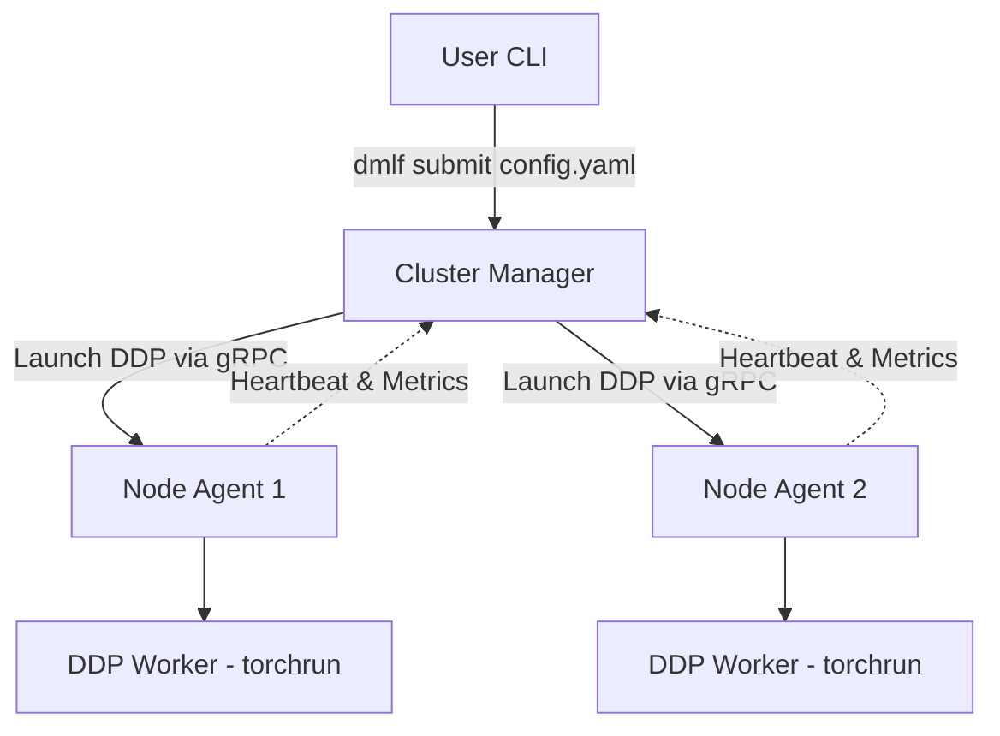

# Distributed Machine Learning Framework (DMLF)

DMLF is a lightweight, fault‑tolerant orchestration layer and distributed training framework built on top of **PyTorch Distributed Data Parallel (DDP)**.  
It bridges the gap between running ML experiments on a single machine and scaling them seamlessly across a heterogeneous cluster of laptops, workstations, or cloud VMs – without the operational overhead of a full Kubernetes/Slurm deployment.

---

## 🚀 Features

| Area | What you get |
|------|--------------|
| **PyTorch DDP Core** | Native `torch.distributed` + `torchrun` (Gloo / NCCL) |
| **Cluster Management Layer (CML)** | gRPC‑based manager + SQLite state store |
| **Automated Node Discovery** | Agents register themselves, heartbeat every 5 s |
| **YAML Job Submission** | `dmlf submit config.yaml` – no hand‑crafted `torchrun` |
| **Centralised Configuration** | Single `config.yaml` (Pydantic) for ports, intervals, allocator weights, job defaults, auth token |
| **Health & Readiness** | HTTP `/health` & `/ready` on the manager |
| **Prometheus Metrics** | `/metrics` on manager (9090) and agents (9091) – queue depth, job latency, node CPU/GPU/RAM, gRPC latency |
| **Shared‑Token gRPC Auth + Per‑Node Secrets** | Prevents spoofed heartbeats / command streams |
| **Autoscaler** | Policy engine (queue depth, CPU/GPU utilisation) + pluggable provisioner (Docker, K8s, cloud) |
| **Plugin‑Based Scheduler** | `BaseScheduler` ABC, built‑in `PriorityBinPackScheduler`, entry‑point `dmlf.scheduler.plugins` |
| **Helm Chart** | `charts/dmlf/` – manager Deployment, agent DaemonSet/Deployment, ConfigMap/Secret, ServiceMonitor |
| **Docker Image** | One image (`dmlf:latest`) runs **manager**, **agent**, or **cli** via `ENTRYPOINT` script; includes Docker `HEALTHCHECK` |
| **CI / Tests** | GitHub Actions – ruff, mypy, unit + integration tests, Docker build verification |

---

## 🏗️ Architecture (high level)



* **Manager** – gRPC server (50051), HTTP health (8080), Prometheus (9090). Holds SQLite DB, job queue, scheduler, autoscaler.
* **Agent** – registers, heartbeats, streams logs, launches `torchrun` on command.
* **CLI** – thin wrapper that calls `SubmitJob` RPC.

---

## 🛠️ Installation

```bash
# 1️⃣ Clone
git clone https://github.com/ShreyanshShakya/Distributed-ML-Training.git
cd Distributed-ML-Training

# 2️⃣ Virtual‑env (Python 3.10+)
python -m venv venv && source venv/bin/activate

# 3️⃣ Dependencies
pip install -r requirements.txt

# 4️⃣ (Optional) Re‑generate gRPC stubs after proto changes
python -m grpc_tools.protoc -I. --python_out=. --grpc_python_out=. dmlf/communication/cml.proto
```

### Docker (single image, three roles)

```bash
docker build -t dmlf:latest .

# Manager
docker run -d --name dmlf-manager \
  -p 50051:50051 -p 8080:8080 -p 9090:9090 \
  -v $(pwd)/config.yaml:/app/config.yaml \
  dmlf:latest manager

# Agent (run one per node, shares manager network)
docker run -d --name dmlf-agent-1 \
  --network container:dmlf-manager \
  -v $(pwd)/config.yaml:/app/config.yaml \
  dmlf:latest agent

# One‑off job submit
docker run --rm --network container:dmlf-manager \
  -v $(pwd)/config.yaml:/app/config.yaml \
  -v $(pwd)/dmlf/configs:/app/dmlf/configs \
  dmlf:latest cli submit /app/dmlf/configs/resnet.yaml
```

---

## ⚙️ Configuration (`config.yaml`)

All tunables live in a single YAML file (validated by Pydantic). Example:

```yaml
manager:
  grpc_port: 50051
  http_health_port: 8080
  heartbeat_interval_sec: 5
  offline_timeout_sec: 15
  scheduler_interval_sec: 2
  auth_token: "CHANGE_ME_32_BYTE_HEX"

scheduler:
  plugin: "dmlf.manager.schedulers.builtin:PriorityBinPackScheduler"

agent:
  reconnect_base_sec: 2
  reconnect_max_sec: 30

allocator:
  gpu_weight: 1.0
  cpu_weight: 0.5
  ram_weight: 0.1

job_defaults:
  max_retries: 3
  checkpoint_interval_minutes: 5
  backend: "gloo"          # "nccl" for GPU, "gloo" for CPU/Windows

metrics:
  manager_port: 9090
  agent_port: 9091

autoscaler:
  enabled: true
  interval_sec: 5
  queue_depth_high: 5
  avg_cpu_high: 80
  avg_gpu_high: 70
  queue_depth_low: 0
  avg_cpu_low: 20
  avg_gpu_low: 10
  scale_in_cooldown_sec: 300
  scale_callback: "dmlf.autoscaler.default_callback:scale_callback"
```

*Every component (`manager`, `agent`, `cli`) reads this file via `--config` (default `config.yaml`).*

---

## 🏃‍♂️ Quick Start (local simulation)

```bash
# Terminal 1 – manager
python -m dmlf.manager.cluster_manager --config config.yaml

# Terminal 2 & 3 – two agents
python -m dmlf.agent.agent --config config.yaml

# Terminal 4 – submit the sample job
python -m dmlf.cli --config config.yaml submit dmlf/configs/resnet.yaml
```

The manager will pick two idle agents and launch a distributed `torchrun` training loop.

---

## 📦 Job Configuration (`dmlf/configs/resnet.yaml`)

```yaml
cluster:
  nodes: 2
  backend: gloo

training:
  script_path: "train.py"
  nproc_per_node: 1
  args: ""
  # optional per‑job overrides (fallback to job_defaults in config.yaml)
  max_retries: 3
  checkpoint_interval_minutes: 5
  backend: "gloo"
```

---

## 🐳 Docker & Kubernetes

### Docker‑Compose (single host, no K8s)

```yaml
# docker-compose.yml (same services as the Helm chart)
version: "3.9"
services:
  manager:
    build: .
    command: manager
    ports: ["50051:50051","8080:8080","9090:9090"]
    volumes: ["./config.yaml:/app/config.yaml:ro"]
  agent:
    build: .
    command: agent
    deploy:
      replicas: 2
    volumes: ["./config.yaml:/app/config.yaml:ro"]
```

```bash
docker compose up -d
```

### Helm Chart (Kubernetes)

```bash
# Install / upgrade
helm upgrade --install dmlf ./charts/dmlf \
  --set global.authToken=YOUR_32_BYTE_HEX_TOKEN \
  --set global.image.repository=dmlf \
  --set global.image.tag=latest
```

**What the chart creates**

| Resource | Purpose |
|----------|---------|
| ConfigMap `dmlf-config` | Full `config.yaml` (merged with `values.yaml`) |
| Secret `dmlf-secret` | `auth_token` for gRPC auth |
| Deployment `…-manager` | Single replica, ports 50051/8080/9090 |
| DaemonSet `…-agent` (default) | One agent per node; switch to Deployment via `agent.daemonset:false` |
| Service `…-manager` | ClusterIP for gRPC, health, metrics |
| ServiceMonitor | Prometheus scrape of `/metrics` (requires `prometheus-operator`) |

*After install the manager is reachable at `dmlf-manager:50051`, health at `http://dmlf-manager:8080/health`, metrics at `http://dmlf-manager:9090/metrics`.*

---

## ☁️ Running on AWS (personal‑project scale)

| Option | When to use | Rough monthly cost* | Ops effort |
|--------|-------------|---------------------|------------|
| **Single EC2 (GPU) + Docker‑Compose** | One‑off experiments, < 5 concurrent jobs | $30‑$100 (stop when idle) | Manage EC2, SG, Docker |
| **ECS Fargate (or EC2‑backed ECS)** | “Serverless” containers, IAM per task | $30‑$80 | ECS cluster, task defs |
| **EKS + Helm chart** | Already on K8s, need GitOps, GPU autoscaling | $70‑$150 | EKS control plane, node‑group, Helm |

*All prices US‑East‑1 on‑demand, 2026‑08‑08; Spot / Savings Plans can cut 60‑90 %.*

**Quick EC2 + Docker‑Compose** (cheapest for a personal backend):

```bash
# 1️⃣ Launch a GPU instance (Amazon Linux 2023)
aws ec2 run-instances \
  --image-id resolve:ssm:/aws/service/ami-amazon-linux-latest/amzn2-ami-hvm-x86_64-gp2 \
  --instance-type g4dn.xlarge \
  --key-name YOUR_KEY \
  --security-group-ids sg-xxxx \
  --subnet-id subnet-xxxx \
  --tag-specifications 'ResourceType=instance,Tags=[{Key=Name,Value=dmlf-backend}]'

# 2️⃣ SSH, install docker & compose, pull/build image, write docker-compose.yml (see above) and run:
docker compose up -d
```

*Stop the instance when not needed (`aws ec2 stop-instances …`) – you only pay for the EBS volume while stopped.*

When you later need **autoscaling GPU pools**, keep the same Docker image & Helm chart, spin a tiny EKS cluster (`eksctl create cluster … --node-type g4dn.xlarge --nodes-max 4`) and install the chart. Add a `K8sProvisioner` (few lines of Python using the Kubernetes client) that the autoscaler calls to patch the Agent DaemonSet/Deployment replica count.

---

## 🧪 Testing & CI

```bash
# Unit tests (pure logic)
pytest -q tests/unit

# Integration test – spawns manager + 2 agents in‑process, submits a job
pytest -q tests/integration/test_local_spawn.py
```

GitHub Actions (`.github/workflows/ci.yml`) runs on every push/PR:

1. `ruff` lint  
2. `mypy` type‑check  
3. Unit tests  
4. Integration test (local spawn)  
5. `docker build` verification

---

## 📊 Roadmap

| Phase | Status |
|-------|--------|
| **v0.1** PyTorch DDP Core (MVP) | ✅ |
| **v0.2** Cluster orchestration (gRPC/SQLite), health, structured logging | ✅ |
| **v0.3** Shared‑token auth, node secrets, Docker image, CI, unit & integration tests | ✅ |
| **v0.4** Prometheus metrics, autoscaler, plugin‑scheduler, Helm chart | ✅ |
| **v0.5** K8s provisioner for autoscaler, predictive scaling, Grafana dashboards | 🚧 |
| **v0.6** Multi‑tenant isolation, cloud‑provider hooks (AWS ASG, GCP MIG) | 🚧 |

---

## 🤝 Contributing

1. Fork & create a feature branch.  
2. Run `ruff`, `mypy`, `pytest` locally.  
3. Open a PR – CI must pass.  
4. Follow the existing code style (type hints, docstrings on public APIs).

---

## 📄 License

MIT © 2026 Shreyansh Shakya – see `LICENSE` for details.

---

*Happy distributed training!* 🎉