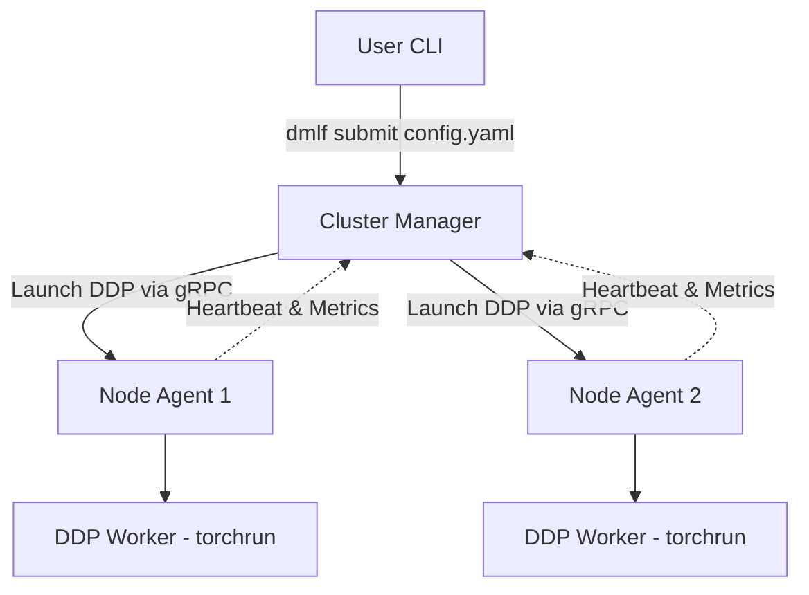

# Distributed Machine Learning Framework (DMLF)

DMLF is a lightweight, fault-tolerant orchestration layer and distributed training framework built on top of PyTorch Distributed Data Parallel (DDP).

It bridges the gap between running ML experiments on a single machine and scaling them seamlessly across a heterogeneous cluster of local machines (like laptops on a LAN) without the massive overhead of Kubernetes or Slurm.

---

## 🚀 Features

- **PyTorch DDP Core**: Leverages PyTorch's native `torch.distributed` and `torchrun` for efficient multi-process gradient synchronization (using Gloo or NCCL).
- **Cluster Management Layer (CML)**: A custom gRPC-based orchestrator that tracks node health, availability, and hardware metrics via SQLite.
- **Automated Node Discovery**: Worker nodes run a lightweight background agent that automatically registers with the central Master node.
- **Heartbeat & Telemetry**: Agents stream CPU, RAM, and GPU utilization metrics to the master every 5 seconds (configurable).
- **YAML Job Submission**: No more manually configuring complex `torchrun` commands across multiple machines. Submit a single YAML file, and the Master node automatically provisions the cluster and dispatches the execution payloads.
- **Centralised Configuration**: All ports, intervals, allocator weights, and defaults live in a single `config.yaml` (loaded via Pydantic).
- **Health & Readiness Endpoints**: HTTP `/health` and `/ready` on the manager for container orchestrators.
- **Shared‑Token gRPC Authentication** + per‑node secret validation.
- **Docker‑ready**: One image runs manager, agent, or CLI; includes a Docker `HEALTHCHECK`.
- **CI/CD**: GitHub Actions pipeline (ruff, mypy, unit & integration tests, Docker build).

---

## 🏗️ Architecture

### 1. The Master Node (`Cluster Manager`)
The central brain of the framework. It maintains the cluster state (idle, training, offline) in a local SQLite database and hosts a gRPC server to receive heartbeats and job submissions. It also serves an HTTP health endpoint.

### 2. The Worker Nodes (`Node Agent`)
A lightweight daemon running on all compute nodes. It profiles the local hardware on startup, registers with the Master (receiving a node‑secret), and maintains an open gRPC stream waiting for `LAUNCH_JOB` commands.

### 3. The CLI
A user‑friendly command‑line interface to submit jobs to the Cluster Manager.



---

## 🛠️ Installation

1. **Clone the repository**
2. **Create a virtual environment (Python 3.10+ recommended)**
   ```bash
   python -m venv venv
   source venv/bin/activate
   ```
3. **Install Dependencies**
   ```bash
   pip install -r requirements.txt
   ```
4. **Compile gRPC Protobufs** (only if you modify `dmlf/communication/cml.proto`)
   ```bash
   python -m grpc_tools.protoc -I. --python_out=. --grpc_python_out=. dmlf/communication/cml.proto
   ```

---

## ⚙️ Configuration (`config.yaml`)

All runtime knobs are defined in a single `config.yaml` at the repository root.

```yaml
manager:
  grpc_port: 50051
  http_health_port: 8080
  heartbeat_interval_sec: 5
  offline_timeout_sec: 15
  scheduler_interval_sec: 2
  auth_token: "CHANGE_ME_32_BYTE_HEX"   # shared bearer token for gRPC auth
agent:
  reconnect_base_sec: 2
  reconnect_max_sec: 30
allocator:
  gpu_weight: 1.0
  cpu_weight: 0.5
  ram_weight: 0.1
job_defaults:
  max_retries: 3
  checkpoint_interval_minutes: 5
  backend: "gloo"          # "nccl" for GPU, "gloo" for CPU/Windows
```

*Every component (`manager`, `agent`, `cli`) reads this file via `--config` (default `config.yaml`).*

---

## 🏃‍♂️ Quick Start (Local Cluster Simulation)

You can simulate a distributed cluster on a single machine by running the Master and Agents in separate terminals.

### 1. Start the Cluster Manager (Terminal 1)

```bash
source venv/bin/activate
python -m dmlf.manager.cluster_manager --config config.yaml
```
*Expected output:* `Cluster Manager started on port 50051`  
Health endpoint: `http://localhost:8080/health`

### 2. Start the Node Agents (Terminals 2 & 3)

```bash
source venv/bin/activate
python -m dmlf.agent.agent --config config.yaml
```
*Expected output:* `Registration successful! Node ID: node-xxxx`

### 3. Submit a Training Job (Terminal 4)

```bash
source venv/bin/activate
python -m dmlf.cli --config config.yaml submit dmlf/configs/resnet.yaml
```

The Cluster Manager will select idle nodes and automatically spin up the distributed `torchrun` training loops!

---

## 📦 Job Configuration (`dmlf/configs/resnet.yaml`)

```yaml
cluster:
  nodes: 2
  backend: gloo

training:
  script_path: "train.py"
  nproc_per_node: 1
  args: ""
  # optional overrides (fallback to job_defaults in config.yaml)
  max_retries: 3
  checkpoint_interval_minutes: 5
  backend: "gloo"
```

---

## 🐳 Docker Usage (single image, three roles)

```bash
# Build once
docker build -t dmlf:latest .

# Manager (exposes gRPC 50051 + HTTP health 8080)
docker run -d --name dmlf-manager \
  -p 50051:50051 -p 8080:8080 \
  -v ${PWD}/config.yaml:/app/config.yaml \
  dmlf:latest manager

# Agent (shares manager's network namespace)
docker run -d --name dmlf-agent-1 \
  --network container:dmlf-manager \
  -v ${PWD}/config.yaml:/app/config.yaml \
  dmlf:latest agent

# One‑off CLI submit
docker run --rm --network container:dmlf-manager \
  -v ${PWD}/config.yaml:/app/config.yaml \
  -v ${PWD}/dmlf/configs:/app/dmlf/configs \
  dmlf:latest cli submit /app/dmlf/configs/resnet.yaml
```

The image contains a `HEALTHCHECK` that curls `http://localhost:8080/health` every 30 s (manager only).

A `docker-compose.yml` is also provided for a full stack bring‑up.

---

## 🔐 Authentication

* **Shared bearer token** – set `manager.auth_token` in `config.yaml`.  
  All gRPC calls (manager↔agent, CLI↔manager) must carry `Authorization: Bearer <token>`.
* **Node secret** – generated by the manager on registration, returned to the agent, and required on every subsequent RPC (`node-secret` metadata). This prevents spoofed heartbeats or command streams.

---

## 🧪 Testing & CI

```bash
# Unit tests (pure logic)
pytest -q tests/unit

# Integration test – spawns manager + 2 agents in‑process and submits a job
pytest -q tests/integration/test_local_spawn.py
```

GitHub Actions (`.github/workflows/ci.yml`) runs on every push/PR:

1. `ruff` lint  
2. `mypy` type‑check  
3. Unit tests  
4. Integration test (local spawn)  
5. `docker build` verification

---

## 📊 Roadmap

- **Phase 1**: PyTorch DDP Core (MVP) ✅  
- **Phase 2**: Cluster Orchestration Layer (gRPC/SQLite) ✅  
- **Phase 3**: Shared‑token auth, node secrets, Docker, CI, tests ✅ (v0.3)  
- **Phase 4**: Prometheus metrics, autoscaling policies, plugin‑based scheduler 🚧  
- **Phase 5**: Kubernetes / cloud deployment (Helm, Kustomize) 🚧  

--- 

*Happy distributed training!* 🎉